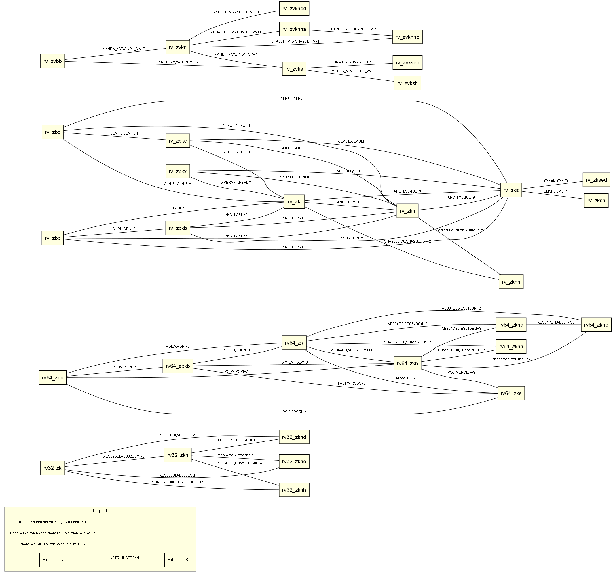

# RISC-V Instruction Set Explorer

A Node.js CLI tool that parses `instr_dict.json`, cross-references the RISC-V ISA manual, and visualizes extension sharing relationships — across three tiers.

---

## Prerequisites

- [Node.js](https://nodejs.org/) v16 or newer
- [Git](https://git-scm.com/) (for cloning the ISA manual in Tier 2)

No external npm packages required — only Node built-ins are used.

---

## Installation

```bash
git clone https://github.com/haaasini01/risc-v-task
cd risc-v-task
```

Place `instr_dict.json` in the project root (from the [riscv-extensions-landscape](https://github.com/rpsene/riscv-extensions-landscape) repo).

For Tier 2, clone the ISA manual into the project root:

```bash
git clone --depth=1 https://github.com/riscv/riscv-isa-manual.git
```

---

## Running

```bash
node index.js              # Run all tiers (default)
node index.js --tier 1     # Tier 1: parsing & grouping only
node index.js --tier 2     # Tier 2: cross-reference only
node index.js --tier 3     # Tier 3: extension sharing graph + unit tests
```

Custom paths:

```bash
node index.js --json /path/to/instr_dict.json --manual /path/to/riscv-isa-manual/src
```

### npm shorthand scripts

```bash
npm start        # All tiers
npm run tier1
npm run tier2
npm run tier3
npm test         # Unit tests only
```

---

## Sample Output

Every run writes two timestamped files to the project root:

- `sample_output_YYYYMMDD_HHMMSS.txt` — full program output
- `extension_graph_YYYYMMDD_HHMMSS.dot` — Graphviz DOT file (Tier 3)

Each output file opens with an **Output Summary** block for quick scanning, followed by the full detailed output for each tier.

### Output Summary

```
════════════════════════════════════════════════════════════════════════════════════
  OUTPUT SUMMARY
════════════════════════════════════════════════════════════════════════════════════
Generated: 2026-05-17T13:52:52Z
Output file: C:/.../sample_output_20260517_192252.txt
Tier: all
JSON source: ./instr_dict.json
Manual source: ./riscv-isa-manual/src

Tier 1: Instruction summary
  Extensions: 114
  Instruction-extension pairs: 1343
  Shared instructions: 73

Tier 2: Cross-reference summary
  Matched extensions: 51
  JSON-only extensions: 34
  Manual-only extensions: 106

Tier 3: Graph summary
  Connected nodes: 32
  Edges: 57
  DOT file: extension_graph_20260517_192252.dot
  PNG file: extension_graph_20260517_192252.png
  Unit tests run: yes
  Tests passed: 25
  Tests failed: 0

════════════════════════════════════════════════════════════════════════════════════
```

### Tier 1 — Extension Summary Table

```
════════════════════════════════════════════════════════════
  RISC-V Extension Summary Table
════════════════════════════════════════════════════════════
Extension             Count   Example Mnemonic
────────────────────────────────────────────────────────────
rv32_zk               10      AES32DSI
rv64_zba              5       ADD_UW
rv_i                  37      ADD
rv_v                  627     VAADD_VV
...
────────────────────────────────────────────────────────────
Total extensions:               114
Total instruction-extension pairs: 1396
```

### Tier 1 — Shared Instructions

```
════════════════════════════════════════════════════════════
  Instructions Belonging to Multiple Extensions
════════════════════════════════════════════════════════════
  AES32DSI  ->  rv32_zknd, rv32_zk, rv32_zkn
  SH1ADD    ->  rv_zba, rv32_zba
  ...
Total shared instructions: 73
```

### Tier 2 — Cross-Reference Report

```
══════════════════════════════════════════════════════════════════════
  RISC-V Cross-Reference Report: JSON ↔ ISA Manual
══════════════════════════════════════════════════════════════════════

Matched Extensions (56)
   zba    rv_zba    Zba
   zbb    rv_zbb    Zbb
   ...

In JSON only - NOT found in ISA Manual (39)
   ssctr  (as "rv_ssctr")
   ...

In ISA Manual only - NOT found in JSON (19)
   ...

Summary: 56 matched,  39 in JSON only,  19 in manual only
```

### Tier 3 — Extension Sharing Graph

```
  [rv_zk]
    ---> rv_zbb   [ANDN, ORN, ROL … (+2 more)]
    ---> rv_zbc   [CLMUL, CLMULH]
    ---> rv_zbkb  [ANDN, ORN, PACK … (+4 more)]

  Graph: 32 connected nodes,  57 edges
  DOT file written -> ./extension_graph_20260517_154903.dot
  PNG image written -> ./extension_graph_20260517_154903.png
```



---

## Unit Tests

```bash
node tests.js
```

25 tests covering parsing, normalisation, cross-referencing, and graph construction - no test framework required.

> Tier 3 runs unit tests automatically, so you don't need to run `node tests.js` separately when using `node index.js`.

---

## Project Structure

```
risc-v-task/

├── pdfs      # cv and coverLetter
├── riscv-isa-manual/    # Cloned ISA manual (Tier 2)
├── src/
    ├── crossref.js      # Tier 2: normalisation & cross-reference
    ├── graph.js         # Tier 3: graph building, DOT & PNG rendering
    └── parser.js        # Tier 1: parsing & grouping
├── index.js             # Entry point & CLI
├── instr_dict.json      # Input — place here
├── package.json
├── README.md
└── tests.js             # 25 unit tests
```

---

## Design Decisions

**Extension normalisation (Tier 2)**
The JSON uses prefixes like `rv_`, `rv32_`, `rv64_` (e.g. `rv_zba`), while the ISA manual uses bare names like `Zba`, `M`, `RV32I`. The `normalise()` function strips prefixes and lowercases everything so all variants map to the same key (e.g. `zba`).

**Manual scanning strategy (Tier 2)**
The `.adoc` files are scanned with a regex matching:
- `Z[a-z][a-zA-Z0-9]{1,14}` — Z-extensions (e.g. `Zba`, `Zicsr`)
- `RV(?:32|64)?[A-Z][A-Za-z0-9]*` — base ISA names (e.g. `RV32I`)
- `[IMAFDQC]` — single-letter base ISA identifiers

This is intentionally broad and may produce some false positives in the "manual only" list.

**Graph filtering (Tier 3)**
Only extensions sharing ≥1 instructions appear as nodes. Isolated extensions are omitted to keep the graph readable.

**PNG auto-rendering (Tier 3)**
After writing the DOT file, `graph.js` immediately shells out to `dot -Tpng` to produce a PNG alongside it. This requires Graphviz to be installed but degrades gracefully — if `dot` is not found, a warning is printed and the run continues normally.